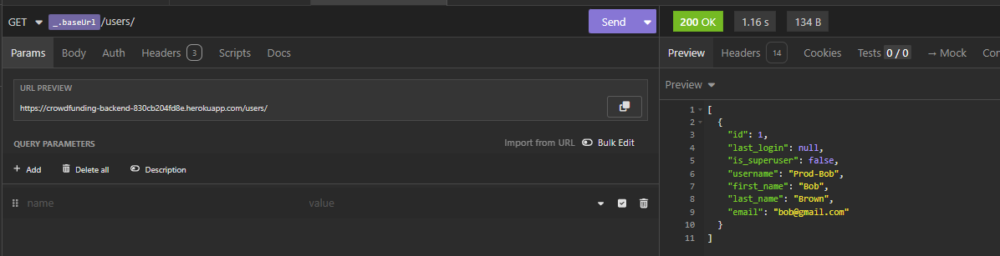
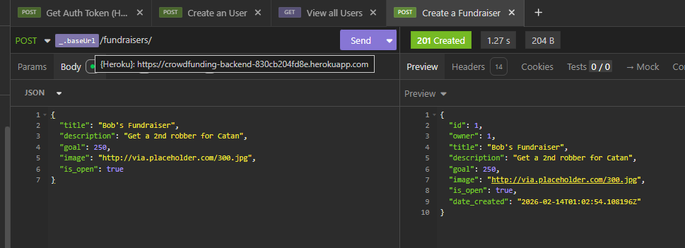
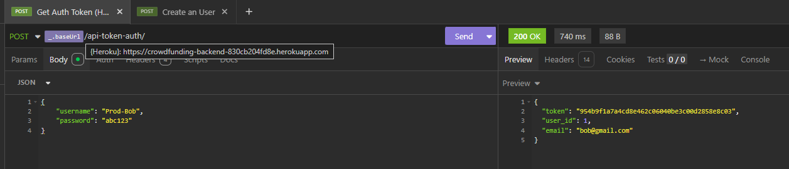

# crowdfunding_back_end

Nicole Chan

## Planning
### Concept / Name
Crowds of Catan is a crowdfunding platform the Catanians (Catan Community) can pitch their Catan-inspired game campaigns and receive community backing. Players become investors; pledging support for creative expansions, custom maps and/or innovative rule variations. Want an extra robber run amok on resources? This project plans to bring those out of the box ambitions of the Catanians to life.

### Intended Audience / User Stories
- Catan players
    - Authenticated users.
    - They have the ability to create, update and delete their fundraisers.
    - Their main goal is to create fundraisers to support their in-game ambitions and view their resource goals.
- Catan game developers 
    - Authenticated users.
    - They have the ability to create, update and delete their fundraisers.
    - Their main goal is to create fundraisers to support their creative expansions, custom maps or rule variations and view their resource goals.
- Catan supporters 
    - Authenticated users. 
    - They have the ability to create pledges.
    - Their main goal is to support fundraisers by pledging their resources.
- Catan visitors are 
    - Unauthenticated users.
    - They have the ability to view fundraisers and pledges.
    - Their main goal is to view the fundraisers as a whole and in detail.

### Front End Pages/Functionality
Home Page
- Functionality
    - View all fundraisers in tile formats
    - Navigate to Login Page via link
    - Navigate to respective fundraiser details page by clicking on tile
- Front End Elements
    - Fundraiser tiles
    - Fundraiser photos
    - Fundraiser truncated description (60-100 characters)
    - Link to Login Page

Login Page
- Functionality
    - Login with account credentials
- Front End Elements
    - Username field
    - Password field
    - Login button
    - Error message for wrong credentials entered

Fundraiser Details Page
- Functionality
    - View pledges, fundraiser photo, fundraiser short description and fundraiser status bar showing resources raised and ideal resources goal
    - Create pledges
- Front End Elements
    - Fundraiser title
    - Fundraiser photo
    - Fundraiser short description
    - Funraiser status bar showing amount raised and target goal
    - Side section on making pledges 
        - Name field (Mandatory)
        - Amount field (Mandatory)
        - Description field (Optional)
        - Create pledge button
        - Status message indicating saved pledge is successful

Fundraiser Admin Page
- Prerequisite 
    - Succuessful authenticiation
- Functionality
    - Create new fundraiser
    - Update existing fundraiser on title, photo and/or description by clicking on respective tiles and update button
    - Delete existing fundraiser and subsequent pledges by clicking on respective tiles and delete button
- Front End Elements
    - Fundraiser tiles showing fundraiser titles and photos
    - Create button
    - Update button
    - Delete button
    - Save changes button
    - Fundraiser title field
    - Fundraiser photo upload
    - Fundraiser description field
    - Fundraiser Target Amount field

Account Admin Page
- Prequisite
    - Succuessful authenticiation
- Functionality
    - Update first name
    - Update last name
    - Update email address
    - Update password
- Front End Elements
    - First name field (Optional)
    - Last name field (Optional)
    - Email field (Optional)
    - Password field (Optional)
    - Save changes button
    - Status message indicating saved changes is successful

### API Spec

| URL                      | HTTP Method | Purpose              | Request Body                                     | Response                                                                   | Success Response Code | Authentication/Authorisation |
|--------------------------|-------------|----------------------|--------------------------------------------------|----------------------------------------------------------------------------|-----------------------|------------------------------|
| /users                   | POST        | Create an account    | username, first name, last name, email, password | id, last_login, is_superuser, username, first_name, last_name, email       | 201 Created           | none                         |
| /api-token-auth/         | POST        | Authenticate User    | username, password                               | token, user_id, email                                                      | 200 OK                | none                         |
| /users/                  | GET         | View all users       |                                                  | id, last_login, is_superuser, username, first_name, last_name, email       | 200 OK                | none                         |
| /users/{id}              | GET         | View an user         |                                                  | id, last_login, is_superuser, username, first_name, last_name, email       | 200 OK                | none                         |
| /fundraisers             | GET         | View all fundraisers |                                                  | id, owner, title, description, goal, image, is_open, date_created          | 200 OK                | none                         |
| /fundraisers/{id}        | GET         | View a fundraiser    |                                                  | id, owner, pledges, title, description, goal, image, is_open, date_created | 200 OK                | none                         |
| /fundraisers             | POST        | Create a fundraiser  | title, description, goal, image, is_open         | id, owner, title, description, goal, image, is_open, date_created          | 201 Created           | authenticated user           |
| /fundraisers/{id}        | PUT         | Update a fundraiser  | title, description, goal, image, is_open         | id, owner, pledges, title, description, goal, image, is_open, date_created | 204 No Content        | authenticated user           |
| /fundraisers/{id}        | DELETE      | Delete a fundraiser  |                                                  |                                                                            | 204 No Content        | authenticated user           |
| /pledges/                | GET         | View all pledges     |                                                  | id, supporter, amount, comment, anonymous, fundraiser                      | 200 OK                | none                         |
| /pledges/{id}            | GET         | View a pledge        |                                                  | id, supporter, amount, comment, anonymous, fundraiser                      | 200 OK                | none                         |
| /fundraisers/{id}/pledge | POST        | Create a pledge      | amount, comment, anonymous, fundraiser           | id, supporter, amount, comment, anonymous, fundraiser                      | 201 Created           | authenticated user           |

### Database Schema

### API screenshots

Get Request

Post Request

Token Return

